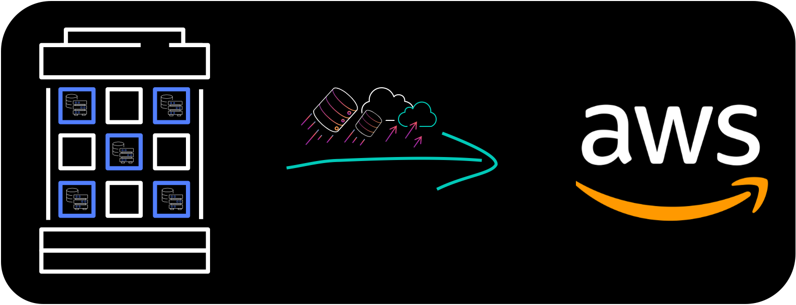

# MIGRATING YOUR MONGODB DATABASES TO DOCUMENTDB

Mystique Unicorn App backend is hosted on mongodb. Recenly one of their devs discovered that AWS released Amazon DocumentDB (with MongoDB compatibility) a fast, scalable, highly available, and fully managed document database service that supports MongoDB workloads.

Can you help them migrate from mongodb to documentdb?

## 🎯 Solutions

We will follow an multi-stage process to accomplish our goal. We need the following components to get this right,

1. **Source Database - MongoDB**
   - If in AWS: EC2 instance in a VPC, Security Group, SSH Keypair(Optional)
   - Some dummy data inside the database
1. **Destination Database - DocumentDB**
   - Subnet Groups
   - VPC Security Groups
1. **Database Migration Service(DMS) - Replication Instance**
   - DMS IAM Roles
   - Endpoints
   - Database Migration Tasks



In this article, we will build an architecture, similar to the one shown above - A simple API using API Gateway which will trigger a Lambda function. We will have an stageVariable `lambdaAlias` and lets assume it is going to be an `prod` environment. The lambda will have multiple alias point at different stage of development. `prod` pointing to the most stable version and `dev` pointing to the bleeding edlge version.

In this Workshop you will practice how to migrate your MongoDB databases to Amazon DocumentDB using different strategies.

1.  ## 🧰 Prerequisites

    This demo, instructions, scripts and cloudformation template is designed to be run in `us-east-1`. With few modifications you can try it out in other regions as well(_Not covered here_).

    - 🛠 AWS CLI Installed & Configured - [Get help here](https://youtu.be/TPyyfmQte0U)
    - 🛠 AWS CDK Installed & Configured - [Get help here](https://www.youtube.com/watch?v=MKwxpszw0Rc)
    - 🛠 Python Packages, _Change the below commands to suit your OS, the following is written for amzn linux 2_
      - Python3 - `yum install -y python3`
      - Python Pip - `yum install -y python-pip`
      - Virtualenv - `pip3 install virtualenv`

    As there are a number of components that need to be setup, we will use a combination of Cloudformation(generated from CDK), CLI & GUI.

1.  ## ⚙️ Setting up the environment

    - Get the application code

      ```bash
      git clone https://github.com/miztiik/dms-mongodb-to-documentdb
      cd dms-mongodb-to-documentdb
      ```

1.  ## 🚀 Prepare the environment

    We will need cdk to be installed to make our deployments easier. Lets go ahead and install the necessary components.

    ```bash
    # If you DONT have cdk installed
    npm install -g aws-cdk

    # Make sure you in root directory
    python3 -m venv .env
    source .env/bin/activate
    pip3 install -r requirements.txt
    ```

    The very first time you deploy an AWS CDK app into an environment _(account/region)_, you’ll need to install a `bootstrap stack`, Otherwise just go ahead and deploy using `cdk deploy`.

    ```bash
    cdk bootstrap
    cdk ls
    # Follow on screen prompts
    ```

    You should see an output of the available stacks,

    ```bash
    vpc-stack
    dms-prerequisite-stack
    mongodb-on-ec2
    ```

1.  ## 🚀 Deploying the Source Database

    Let us walk through each of the stacks,

    - **Stack: vpc-stack**
      This stack will do the following,

      1. Create an custom VPC `miztiikVpc`(_We will use this VPC to host our source MongoDB, DocumentDB, DMS Replication Instance_)

      Initiate the deployment with the following command,

      ```bash
      cdk deploy vpc-stack
      ```

    - **Stack: dms-prerequisite-stack**
      This stack will do the following,

      1. DocumentDB & DMS Security groups - (_created during the prerequisite stack_)
         - Port - `27017` _Accessible only from within the VPC_
      1. DMS IAM Roles - (This stack will **FAIL**, If these roles already exist in your account)
         - `AmazonDMSVPCManagementRole`
         - `AmazonDMSCloudWatchLogsRole`
      1. SSH KeyPair using a custom cfn resource
         - _This resource is currently not used. The intial idea was to use the SSH Keypair to administer the source mongodb on EC2. [SSM Session Manager](https://www.youtube.com/watch?v=-ASMtZBrx-k) does the same job admirably._

      Initiate the deployment with the following command,

      ```bash
      cdk deploy dms-prerequisite-stack
      ```

      After successful completion, take a look at all the resources and get yourself familiar with them. We will be using them in the future.

    - **Stack: Source Database - MongoDB**
      This stack will do the following,

      1. Create an EC2 instance inside our custom VPC(_created during the prerequisite stack_)
      1. Attach security group with mongo port(`27017`) open to the **world** (_For any use-case other than sandbox testing, you might want to restrict it_)
      1. Instance IAM Role is configured to allow SSM Session Manager connections(_No more SSH key pairs_)
      1. Instance is bootstrapped using `user_data` script to install `Mongodb 4.x`
      1. Create user `mongodbadmin` & password (_We will need this later for inserts and DMS_)
      1. Creates a table `miztiik_db`(\_Later we will add a collection `customers`)

      Initiate the deployment with the following command,

      ```bash
      cdk deploy mongodb-on-ec2
      ```

      As our database is a fresh installation, it does not have any data in it. We need some data to migrate. This git repo also includes a `insert_records_to_mongodb.py` that will help us to generate some dummy data and insert them to the database. After successful launch of the stack,

      - Connect to the EC2 instance using SSM Session Manager - [Get help here](https://www.youtube.com/watch?v=-ASMtZBrx-k)
      - Switch to privileged user using `sudo su`
      - Navigate to `/var/log`
      - Run the following commands
        ```bash
        git clone https://github.com/miztiik/dms-mongodb-to-documentdb
        cd dms-mongodb-to-documentdb/dms_mongodb_to_documentdb/stacks/back_end/bootstrap_scripts
        python3 insert_records_to_mongodb
        ```
      - You should be able to see some _`id`_ printed out and a summary at the end,
        _Expected Output_,

        ```json
        {"no_of_records_inserted":114}
        {"total_coll_count":343}
        ```

        If you want to interact with mongodb, you can try out the following commands,

        ```bash
        # Open Mongo shell
        mongo
        # List all Database
        show dbs
        # Use one of the datbases
        use miztiik_db
        db.stats()
        # List all collections
        show collections
        # List some documents in the customer collection
        db.customers.find()
        # List indexes
        db.customers.getIndexes()
        # Quit
        quit()
        ```

        Now we are all done with our source database.

1.  ## 🚀 Deploying the Target Database

    We can automate the creation of DocumentDB & DMS using CDK, But since this will be the first time we use these services,let us use the Console/GUI to set them up. We can leverage the excellant [documentation from AWS](https://docs.aws.amazon.com/documentdb/latest/developerguide/get-started-guide.html) on how to setup our DocumentDB. You should only need to do _Step 3 - Create an Amazon DocumentDB cluster_(Use your own judgement, as docs tend to change over a period of time)

    Couple of things to note,

    - For VPC - Use our custom VPC `miztiikVpc`
    - For Security Group - Use `docsdb_sg_dms-prerequisite-stack`

    Download the public key for Amazon DocumentDB. We will need this to connect to DocumentDB Cluster from your machine and also from DMS Replication Instance

    ```bash
    wget https://s3.amazonaws.com/rds-downloads/rds-combined-ca-bundle.pem
    ```

1.  ## 🚀 Deploying the DMS Replication Instance

    We can leverage the excellant [documentation from AWS](https://docs.aws.amazon.com/dms/latest/userguide/CHAP_GettingStarted.html) on how to setup our DMS Replication Instance.

    Couple of things to note,

    - For VPC - Use our custom VPC `miztiikVpc`
    - For Security Group - Use `dms_sg_dms-prerequisite-stack`

    After creating the replication instance, We need to create few more resources to begin our replication. We will use defaults mostly

    - **Endpoints for source MongoDB**(_custom values listed below_)
      - Source choose mongodb
      - For server address se the private dns of the ec2 instance
      - Auth Mode should be `password`
      - Update user as `mongodbadmin`, the password `Som3thingSh0uldBe1nVault`
      - Authentication source as `admin`
      - Database name `miztiik_db`
      - For endpoing specific attributes, choose the DMS Replication instance we create in the previous step
    - **Endpoint for destination databases - DocumentDB**(_custom values listed below_)
      - Choose `docsdb` as target
      - For server name use the dnsname from docsdb, here is my example,
        - `docsdb.cluster-konstone.us-weast-2.docdb.amazonaws.com`
      - Ensure you choose SSL verification `verify-full` and upload CA certificate for the Amazon DocumentDB public key we downloaded earlier
      - Database name `miztiik_db`
      - For endpoing specific attributes, choose the DMS Replication instance we create in the previous step
    - Database Migration Task
      - Choose our replication instance, source & destination endpoints
      - For Migration Type, choose `Migrate Existing Data`
      - For Table Mappings, _Add new selection rule_, you can create a custom schema name and leave `%` for the table name and Action `Include`
      - Create Task

1.  ## 🔬 Testing the solution

    Navigate to DMS task, under `Table Statistics` You should be able observe that the dms has copied the data from mongodb to documentdb. You can connect to documentdb and test the records using the same commands that we used with mongodb earlier.

    _Additional Learnings:_ You can check the logs in cloudwatch for more information or increase the logging level of the database migration task.

1.  ## 📒 Conclusion

    Here we have demonstrated how to use Amazon Database Migration Service(DMS) to migrate data from MongoDB to DocumentDB.

1.  ## 🎯 Additional Exercises

    We have shown how to migrate existing data using DMS. It is possible to use DMS to replicate changes(Change Data Capture - CDC). For this, you need to setup your mongodb(on EC2/OnPrem) as a replica set and set the migration type of database migration task to `Migrate existing data and replication ongoing changes`

1)  ## 🧹 CleanUp

    If you want to destroy all the resources created by the stack, Execute the below command to delete the stack, or _you can delete the stack from console as well_

    - Resources created during [Deploying The Application](#deploying-the-application)
    - Delete CloudWatch Lambda LogGroups
    - _Any other custom resources, you have created for this demo_

    ```bash
    # Delete from cdk
    cdk destroy

    # Follow any on-screen prompts

    # Delete the CF Stack, If you used cloudformation to deploy the stack.
    aws cloudformation delete-stack \
        --stack-name "MiztiikAutomationStack" \
        --region "${AWS_REGION}"
    ```

    This is not an exhaustive list, please carry out other necessary steps as maybe applicable to your needs.

## 📌 Who is using this

This repository aims to teach api best practices to new developers, Solution Architects & Ops Engineers in AWS. Based on that knowledge these Udemy [course #1][103], [course #2][102] helps you build complete architecture in AWS.

### 💡 Help/Suggestions or 🐛 Bugs

Thank you for your interest in contributing to our project. Whether it's a bug report, new feature, correction, or additional documentation or solutions, we greatly value feedback and contributions from our community. [Start here][200]

### 👋 Buy me a coffee

[](https://ko-fi.com/Q5Q41QDGK) Buy me a [coffee ☕][900].

### 📚 References

1. [Setup MongoDB Community Edition on EC2][1]

1. [Create Database in MongoDB][2]

1. [Create Index in Mongodb][3]

1. [Setup MongoDB for public access][4]

1. [Pymongo Insert][5]

1. [Pymongo Insert][6]

### 🏷️ Metadata

**Level**: 300


[1]: https://docs.mongodb.com/manual/tutorial/install-mongodb-on-amazon/
[2]: https://www.mongodb.com/basics/create-database
[3]: https://www.guru99.com/working-mongodb-indexes.html
[4]: https://ianlondon.github.io/blog/mongodb-auth/
[5]: https://pythonexamples.org/python-mongodb-insert-document/
[6]: https://www.codespeedy.com/create-collections-and-insert-data-to-collection-in-mongodb-python/
[100]: https://www.udemy.com/course/aws-cloud-security/?referralCode=B7F1B6C78B45ADAF77A9
[101]: https://www.udemy.com/course/aws-cloud-security-proactive-way/?referralCode=71DC542AD4481309A441
[102]: https://www.udemy.com/course/aws-cloud-development-kit-from-beginner-to-professional/?referralCode=E15D7FB64E417C547579
[103]: https://www.udemy.com/course/aws-cloudformation-basics?referralCode=93AD3B1530BC871093D6
[200]: https://github.com/miztiik/api-with-stage-variables/issues
[899]: https://www.udemy.com/user/n-kumar/
[900]: https://ko-fi.com/miztiik
[901]: https://ko-fi.com/Q5Q41QDGK
